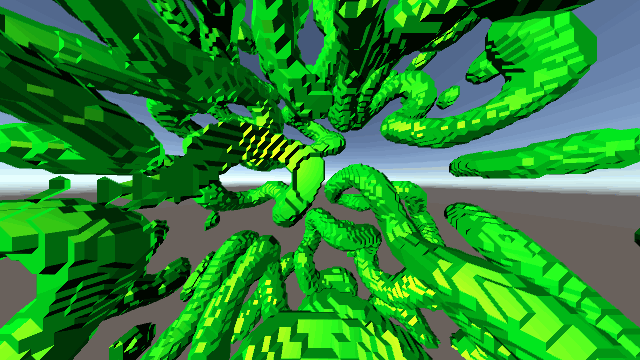

# Reaction Diffusion System 3D for Unity

### System Requirements
- Unity 5.6f3

### References
- Reaction-diffusion system  
https://en.wikipedia.org/wiki/Reaction%E2%80%93diffusion_system
- RDSystem by Keijiro Takahashi  
https://github.com/keijiro/RDSystem
- Marching Cubes  
http://paulbourke.net/geometry/polygonise/
